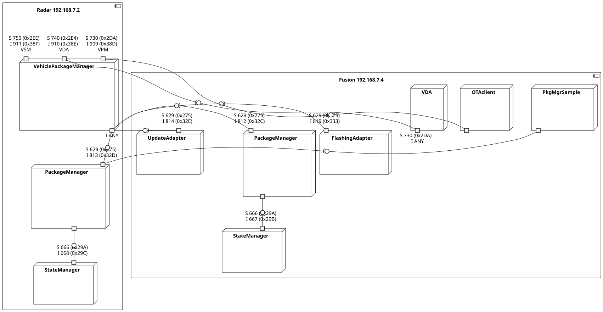

# UCM multi machine setup

This document describes how to run UCM applications in a multi machine setup. This can either be two QEMUs, two native machines or possibly also a mix.

 Deployment of UCM processes on Radar and Fusion machine

## Building and execution in QEMU

Build the images for RadarMachine and FusionMachine.

```bash
bitbake core-image-apd-devel-{radar,fusion}
```

### Startup

#### Virtual tap device

Run the script `yocto-layers/meta-ara/scripts/host-to-qemu-network-connect.sh`. This will create a virtual network device on your host machine:

```
./yocto-layers/meta-ara/scripts/host-to-qemu-network-connect.sh
while this script is running, network adapter 'vmvlan0' will exist on host
connect to virtual hosts via SSH as usual 
ip addr show dev vmvlan0
6: vmvlan0: <BROADCAST,MULTICAST,UP,LOWER_UP> mtu 1500 qdisc fq_codel state UNKNOWN group default qlen 1000
    link/ether 7a:94:cd:19:32:ba brd ff:ff:ff:ff:ff:ff
    inet 192.168.7.200/24 brd 192.168.7.255 scope global vmvlan0
       valid_lft forever preferred_lft forever
    inet6 fe80::7894:cdff:fe19:32ba/64 scope link
       valid_lft forever preferred_lft forever
```

**Make sure you don't have other network interfaces in the range 192.168.7.0/24!**

#### Running the images

You can use the script `yocto-layers/meta-ara/scripts/runqemu-x86-autosar` to run both images from a bitbake session (one for each).

```bash
../yocto-layers/meta-ara/scripts/./runqemu-x86-autosar core-image-apd-devel-radar
../yocto-layers/meta-ara/scripts/./runqemu-x86-autosar core-image-apd-devel-fusion
```

The script will show the full command line to the QEMU and it is useful to copy the command line to be able to manually execute it (otherwise the script always calls bitbake in the background).

## Building and execution in native

## Monitoring with DLT Viewer and Wireshark

If you are able to run DLT Viewer and Wireshark on the same machine as the QEMUs or docker containers, then you just have to configure the connections resp. interface.

|Machine|IP|Port (TCP)|
|-|-|-|
|Radar|192.168.7.2|3490|
|Fusion|192.168.7.4|3490|

On Wireshark, capture on device vmvlan0 resp. docker interface with the capture filter "not port 3490 and not port 22" to exclude DLT and SSH traffic.

### Forwarding setup

If you are running the QEMUs on a remote machine and DLT Viewer on your local, you have to configure appropriate forwardings via SSH, e.g.

```
LocalForward localhost:3490 192.168.7.2:3490
LocalForward localhost:3491 192.168.7.4:3490
```

Then you can configure DLT Viewer like this:

|Machine|IP|Port (TCP)|
|-|-|-|
|Radar|localhost|3490|
|Fusion|localhost|3491|

On the remote machine, use tcpdump to generate a capture file or use Wireshark remote capture feature.

### Service table for decoding the tcpdump

Wireshark will decode the SOME/IP messages to show hex ids. The following table allows you to follow the communication.

|ServiceId Hex|ServiceId Dec|ServiceName|MethodId Hex|MethodId Dec|Method Name|
|-|-|-|-|-|-|
|740|2E4|VDA|7D66|32102|CampaignState_getter|
|740|2E4|VDA|253F|9535|CampaignState_notifier|
|740|2E4|VDA|7D65|32101|ApprovalRequired_getter|
|740|2E4|VDA|253E|9534|ApprovalRequired_notifier|
|740|2E4|VDA|7D67|32103|SafetyConditions_getter|
|740|2E4|VDA|2540|9536|SafetyConditions_notifier|
|740|2E4|VDA|7D68|32104|SafetyState_getter|
|740|2E4|VDA|2541|9537|SafetyState_notifier|
|740|2E4|VDA|7D01|32001|AllowCampaign|
|740|2E4|VDA|7D02|32002|CancelCampaign|
|740|2E4|VDA|7D03|32003|DriverApproval|
|740|2E4|VDA|7D04|32004|GetCampaignHistory|
|740|2E4|VDA|7D05|32005|GetSwClusterDescription|
|740|2E4|VDA|7D06|32006|GetSwPackageDescription|
|740|2E4|VDA|7D07|32007|GetSwProcessProgress|
|740|2E4|VDA|7D08|32008|GetSwTransferProgress|
|740|2E4|VDA|D6D9|55001|ApprovalRequired_eventgroup|
|740|2E4|VDA|D6DA|55002|CampaignState_eventgroup|
|740|2E4|VDA|D6DB|55003|SafetyConditions_eventgroup|
|740|2E4|VDA|D6DC|55004|SafetyState_eventgroup|
|730|2DA|VPM|791E|31006|RequestedPackage_getter|
|730|2DA|VPM|24D9|9433|RequestedPackage_notifier|
|730|2DA|VPM|791F|31007|SafetyState_getter|
|730|2DA|VPM|24DA|9434|SafetyState_notifier|
|730|2DA|VPM|791D|31005|TransferState_getter|
|730|2DA|VPM|24D8|9432|TransferState_notifier|
|730|2DA|VPM|7920|31008|SafetyConditions_getter|
|730|2DA|VPM|24DB|9435|SafetyConditions_notifier|
|730|2DA|VPM|797C|31100|AllowCampaign|
|730|2DA|VPM|7985|31109|CancelCampaign|
|730|2DA|VPM|7987|31111|DeleteTransfer|
|730|2DA|VPM|7986|31110|GetCampaignHistory|
|730|2DA|VPM|797E|31102|GetSwClusterInfo|
|730|2DA|VPM|7988|31112|GetSwPackages|
|730|2DA|VPM|797D|31101|SwPackageInventory|
|730|2DA|VPM|7981|31105|TransferData|
|730|2DA|VPM|7982|31106|TransferExit|
|730|2DA|VPM|797F|31103|TransferStart|
|730|2DA|VPM|7980|31104|TransferVehiclePackage|
|730|2DA|VPM|B159|45401|RequestedPackage_eventgroup|
|730|2DA|VPM|B15A|45402|SafetyState_eventgroup|
|730|2DA|VPM|B15B|45403|TransferState_eventgroup|
|730|2DA|VPM|B15C|45404|SafetyConditions_eventgroup|
|629|275|PM|7535|30005|CurrentStatus_getter|
|629|275|PM|20F6|8438|CurrentStatus_notifier|
|629|275|PM|75BC|30140|Activate|
|629|275|PM|75D0|30120|Cancel|
|629|275|PM|7580|30080|DeleteTransfer|
|629|275|PM|75C6|30150|Finish|
|629|275|PM|75F8|30200|GetHistory|
|629|275|PM|75E4|30180|GetId|
|629|275|PM|7530|30000|GetSwClusterChangeInfo|
|629|275|PM|74CC|29900|GetSwClusterInfo|
|629|275|PM|7544|30020|GetSwPackages|
|629|275|PM|758A|30090|ProcessSwPackage|
|629|275|PM|7594|30100|RevertProcessedSwPackages|
|629|275|PM|75B2|30130|Rollback|
|629|275|PM|756C|30060|TransferData|
|629|275|PM|7576|30070|TransferExit|
|629|275|PM|7562|30050|TransferStart|
|629|275|PM|AD74|44404|CurrentStatus_eventgroup|
